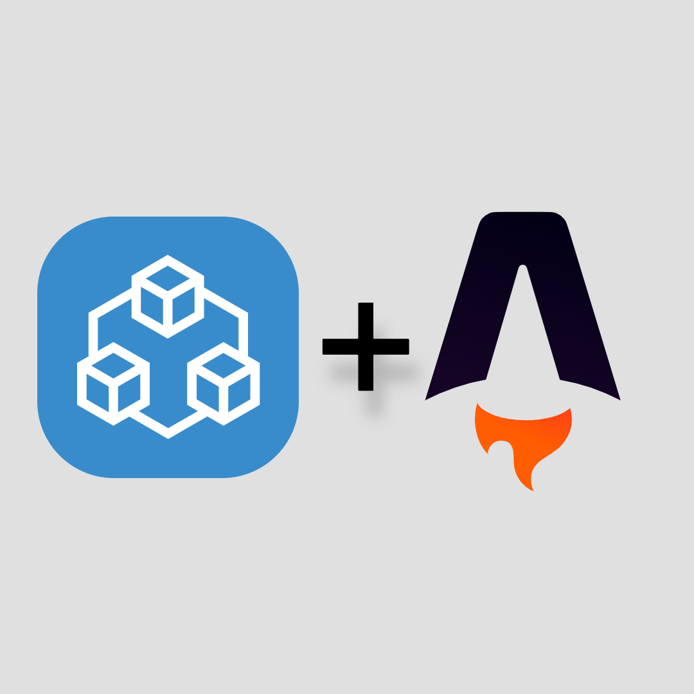
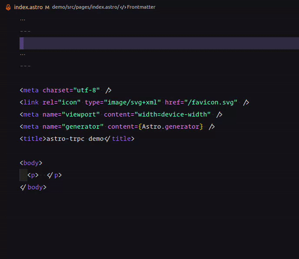

<!-- Ignore the comments, they are for the most placeholders for ideas -->
<p align="center">
    
</p>

<h1 align="center">Astro x tRPC 🚀</h1>
<h4 align="center">End-to-end typesafe APIs in Astro wesbites made easy </h4>

<p align="center">
    <a href="https://github.com/MoustaphaDev/astro-trpc/blob/master/LICENSE" target="_blank">
        
    </a>
    <a href="https://github.com/MoustaphaDev/astro-trpc/fork" target="_blank">
        
    </a>
    <a href="https://github.com/MoustaphaDev/astro-trpc/stargazers" target="_blank">
        
    </a>
    <a href="https://github.com/MoustaphaDev/astro-trpc/issues" target="_blank">
        
    </a>
    <a href="https://github.com/MoustaphaDev/astro-trpc/pulls" target="_blank">
        
    </a>
    <a href="https://npmjs.com/package/astro-trpc" target="_blank">
        
    </a>
</p>

<p align="center">
    <a href="https://stackblitz.com/github/MoustaphaDev/astro-trpc/tree/master/demo" target="_blank">View Demo</a>
    ·
    <a href="https://github.com/MoustaphaDev/astro-trpc/issues/new/choose" target="_blank">Report Bug</a>
    ·
    <a href="https://github.com/MoustaphaDev/astro-trpc/issues/new/choose" target="_blank">Request Feature</a>
</p>


<!-- TOC start -->
# Table of contents
- [Introducing `astro-trpc`](#-introducing-astro-trpc)
- [Demo](#-demo)
- [Basic file structure](#basic-file-structure)
- [Quickstart](#-quickstart)
- [How to use](#️-how-to-use)
- [Inspired by](#-inspired-by)
- [License](#️-license)
- [Contributing to `astro-trpc`](#-contributing-to-astro-trpc)
- [Support](#-support)

<!-- TOC end --><!-- Generated with https://marketplace.visualstudio.com/items?itemName=yzhang.markdown-all-in-one -->

# 👋 Introducing `astro-trpc`

`astro-trpc` is a [tRPC](https://trpc.io/) adapter allowing you to easily build typesafe APIs in [Astro](https://astro.build/).
No code generation, run-time bloat, or build pipeline.

### Many Thanks to all the `Stargazers` who have supported this project with stars(⭐)

[](https://github.com/MoustaphaDev/astro-trpc/stargazers)

# 🚀 Demo
Try out the minimal demo. We hope you enjoy it.

[](https://stackblitz.com/github/MoustaphaDev/astro-trpc/tree/master/demo)

> **Warning**\
> We do not support tRPC v10 yet. We will migrate to v10 soon.

#  Basic file structure

Your file structure should look something like this:
```
├── astro.config.mjs
├── package.json
├── public
│   └── favicon.svg
├── src
│   ├── env.d.ts
│   ├── lib
│   │   └── trpcClient.ts
│   └── pages
│       ├── api
│       │   └── trpc
│       │       └── [trpc].ts
│       └── index.astro
└── tsconfig.json
```

# 💻 Quickstart
To get started, install `astro-trpc` and `@trpc/client` with your favourite package manager
```sh
# Using NPM
npm install astro-trpc @trpc/client

# Using Yarn
yarn add astro-trpc @trpc/client

# Using PNPM
pnpm install astro-trpc @trpc/client
```

**Note:** If you want to use [zod](https://github.com/colinhacks/zod) for input validation - which we we'll use in this introduction - make sure you have enabled [strict mode](https://trpc.io/docs/v10/react#2-enable-strict-mode) in your `tsconfig.json`

# 📚️ How to use

First, let's create our router in our tRPC endpoint, we will use [zod](https://github.com/colinhacks/zod) for validation but you don't have to. For that, we will create a `[trpc].ts` file in the `pages/api/trpc` folder:
```js
// [trpc].ts
import { createAstroTRPCApiHandler } from 'astro-trpc';
import * as trpc from '@trpc/server';
import { z } from 'zod';

// the tRPC router
export const appRouter = trpc.router().query('greeting', {
    input: z
        .object({
            name: z.string().nullish(),
        })
        .nullish(),
    resolve({ input }) {
        return {
            greeting: `hello ${input?.name ?? 'world!'}`,
        };
    },
});

// type definition of the router
export type AppRouter = typeof appRouter;

// API handler
export const all = createAstroTRPCApiHandler({
    router: appRouter,
    createContext: () => null,
});
```

Now, let's create our client. We'll create a `trpcClient.ts` file in `pages/lib`
```js
// trpcClient.ts
import { createTRPCClient } from '@trpc/client';
import type { AppRouter } from '../pages/api/trpc/[trpc]';

export const client = createTRPCClient<AppRouter>({
    url: process.env.NODE_ENV === 'production'
            ? import.meta.env.TRPC_ENDPOINT_URL
            : `http://localhost:3000/api/trpc`,
});
```
\
Now that we're set up, we can start consuming our API. Let's see it in action:
```tsx
// index.astro
---
import { client } from '../lib/trpcClient';

const data = await client.query("greeting", {name: "Astro 🚀"});
---

<meta charset="utf-8" />
<link rel="icon" type="image/svg+xml" href="/favicon.svg" />
<meta name="viewport" content="width=device-width" />
<meta name="generator" content={Astro.generator} />
<title>astro-trpc demo</title>

<body>
  <p> {data.greeting} </p>
</body>
```

You can notice the autocompletion you get when using the client and also errors when you provide the wrong types to the API  or query an inexisting route.

\
\
Now let's start the dev server to see our changes

### You can now enjoy the full power of tRPC in Astro 👏 ! 


<!-- # 🔥 Features -->

# 💡 Inspired by
- [tRPC-SvelteKit](https://github.com/icflorescu/trpc-sveltekit): End-to-end typesafe APIs with tRPC.io in SvelteKit applications.
- [@trpc/server/adapters/next](https://github.com/trpc/trpc/tree/next/packages/server/src/adapters) - Official tRPC adapter for NextJS 

# 🛡️ License
This project is licensed under the MIT License - see the [`LICENSE`](LICENSE) file for details.

<!-- # 🦄 Upcoming Features
`astro-trpc` aims to reach parity with `@trpc/server/adapters/next`

- ✔️ Better api. -->

If you find something is missing, we're listening listening. Please create a feature request [from here](https://github.com/MoustaphaDev/astro-trpc/issues/new).

<!-- # 🏃‍♀️ Deploy

<a href="https://vercel.com/new/project?template=https://github.com/MoustaphaDev/astro-trpc/demo">

</a>
<a href="https://app.netlify.com/start/deploy?repository=https://github.com/MoustaphaDev/astro-trpc/demo">

</a> -->


# 🤝 Contributing to `astro-trpc`
Any kind of positive contribution is welcome! Please help us improve this project by contributing.

# 🙏 Support

Before you move away, please give this project a ⭐️ if you liked it. That's the best way you can show your support

<!-- If you found this package helpful, consider supporting us with a coffee.

<a href="https://www.buymeacoffee.com/idontdeserveritlol"> xD
    
</a> -->

---

This project follows the [all-contributors](https://github.com/all-contributors/all-contributors) specification. Contributions of any kind welcome!

<!-- _✨ Special thanks to [@tapasadhikary](https://twitter.com/tapasadhikary) for his good teachings on how to get started in opensource ✨_ -->
